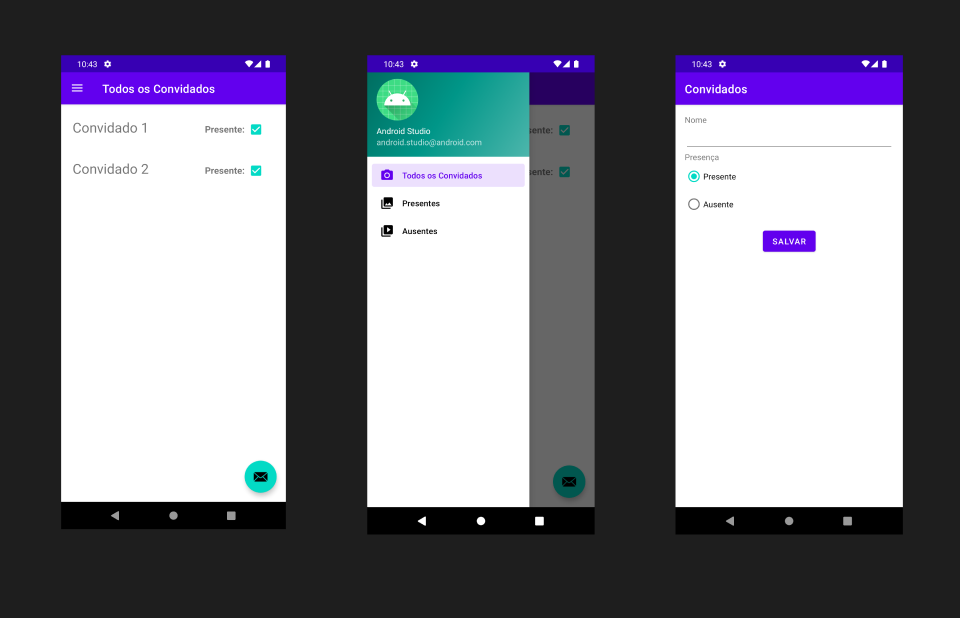

# Aplicativo Convidados

  <a href="#-tecnologias">Tecnologias</a>&nbsp;&nbsp;&nbsp;|&nbsp;&nbsp;&nbsp;
  <a href="#-projeto">Projeto</a>&nbsp;&nbsp;&nbsp;|&nbsp;&nbsp;&nbsp;
  <a href="#memo-licença">Licença</a>

  

 

## 🚀 Tecnologias

Neste projeto utilizei as seguintes tecnologias:

- Kotlin
- ROOM
- LiveData
- Arquitetura MVVM

## 📱 Projeto

Aplicativo criado para aprofundar os fundamentos de Android com Kotlin.

Com esse projeto aprendi diversos fundamentos do Android, como RecyclerView, Banco de dados com ROOM
e Navegação com Navigation Drawer e Courotines.

Curso: https://www.udemy.com/course/curso-desenvolvedor-kotlin

## :memo: Licença

Esse projeto está sob a licença MIT.

---

Desenvolvido por Thiago Ferreira :wave:
